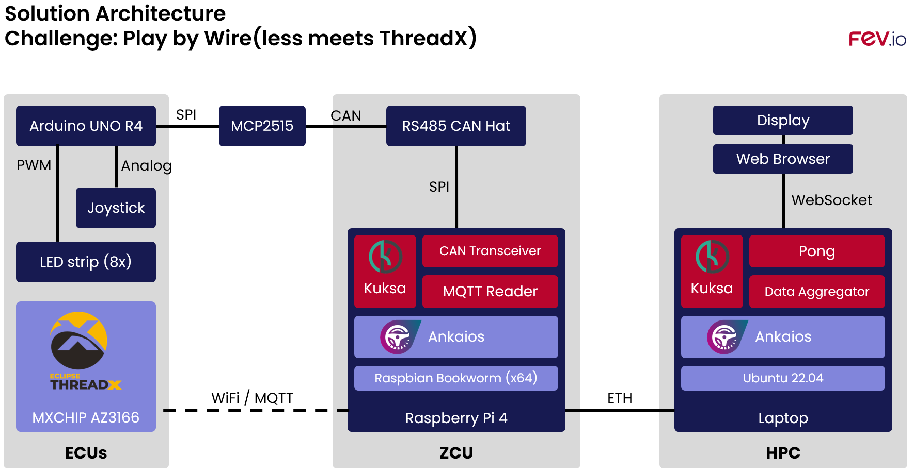

# FEVio

This repository includes the source code, information and documentation created by the FEV.io team that solves the challenge "Play by Wire" in the Eclipse SDV Hackathon 2024.

The overall architecture with the most important hardware and software elements is depicted below.



## Storyline

After a long drive, the driver and the passenger decide to grab a coffee and charge their vehicle.
To relax they decide to play a game on the infotainment.
Each player can choose their "color".
The ambient light in the car will be illuminated in the winning player's color.


## Cloning

Either specify while cloning `--recurse-submodules` to download the submodules or alternatively update it afterward.

```shell
git submodule init
git submodule update --recursive
```

## MXChip AZ3166

As one alternative input device for the user to interact with the vehicle we use the MXChip AZ3166 IoT DevKit.
A fork of the challenge repository has been created and network and MQTT have been implemented.

### OpenOCD

[OpenOCD](https://github.com/openocd-org/openocd) is used to flash the MXChip AZ3166.

```shell
./bootstrap
./configure
make
sudo make install 
```

#### Flashing

To flash the MXChip AZ3166, use `challenge-threadx-and-beyond/MXChip/AZ3166/scripts/flash.sh`.
