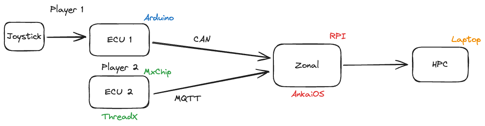

# FEVio



Either specify while cloning `--recurse-submodules` to download the submodules or alternatively update it afterward.

```shell
git submodule init
git submodule update --recursive
```

## OpenOCD

[OpenOCD](https://github.com/openocd-org/openocd) is used to flash the MXChip AZ3166.

```shell
./bootstrap
./configure
make
sudo make install 
```
